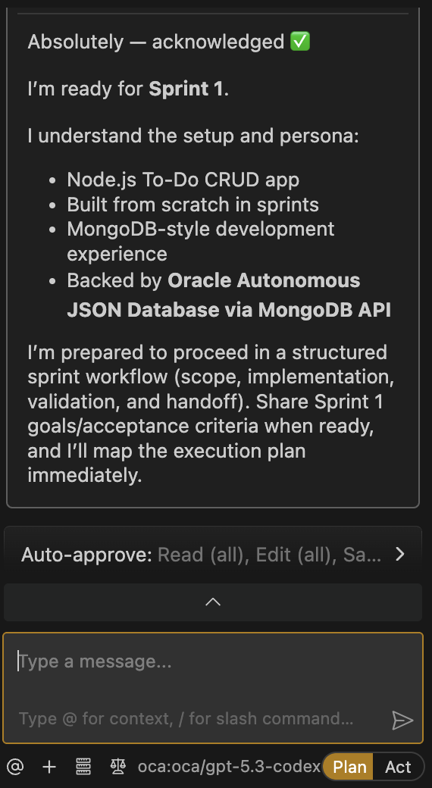
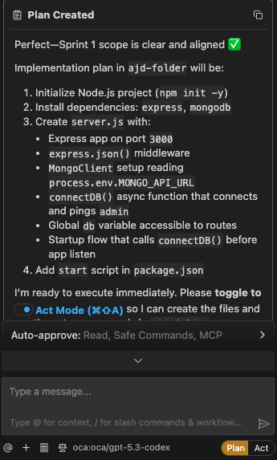

# Lab 3: Vibe Coding the AJD Mongo To-Do App

## Introduction

To-Do App UI Screenshot Above Fold
*This screenshot shows the final To-Do application layout that you will build by the end of the sprints. Use it as a visual success target.*

To-Do App UI Screenshot CRUD Actions
*This screenshot highlights completing and deleting todos, demonstrating the full CRUD workflow that you will implement.*

Modern developers are increasingly using AI agents to accelerate application development. Instead of writing every file manually, developers can now guide intelligent tooling to scaffold projects, generate working code, and iterate quickly. This emerging workflow is often referred to as **vibe coding** — a collaborative development approach where the developer focuses on intent, architecture, and validation while the AI assists with implementation.

In this lab, you will apply vibe coding techniques to build a full-stack MongoDB-compatible To-Do application backed by **Oracle Autonomous JSON Database (AJD)** using its MongoDB API.

The goal is not just to build a simple CRUD application. It demonstrates a key architectural concept:

> Existing MongoDB development patterns can continue unchanged while Oracle AI Database provides a scalable, autonomous backend.

You will guide the AI assistant through a sequence of **development sprints**, each representing a focused milestone in building the application.

Throughout the process, we will repeatedly go through the following steps:
1. **Planning**: Crafting the prompt.
2. **Reviewing the plan**: Checking the AI's proposed implementation.
3. **Acting on the plan**: Allowing the AI to write the code.
4. **Validating and adjusting**: Testing the output and making necessary corrections.

By the end of this lab, you will have vibe coded a complete source application that will later be migrated in the next lab.

**Estimated Time:** 35 minutes

---

## Objectives

In this lab you will:

* Run structured AI-assisted development sprints
* Build a Node.js + Express MongoDB CRUD backend
* Generate a browser-based UI
* Connect the application to AJD
* Validate end-to-end functionality

---

## Prerequisites

This lab assumes you have:

* Completed previous labs
* Node.js and npm installed
* An AJD MongoDB API connection string
* VS Code with Cline configured

---

## Task 1: Sprint 0 — Grounding the AI Session

**Goal:** Provide context so the AI understands the persona and architecture.

### 1. Planning: Crafting the prompt

*How to construct this prompt:* Start by providing clear context about the project, the developer persona, and the specific technologies (Node.js, Express, MongoDB driver, and Oracle AJD). Supplying a full Product Definition Document ensures that the AI has a solid foundation before generating any code.

Provide this grounding prompt:

```text
Hi Cline, we are starting a new lab.

We are building a Node.js To-Do CRUD application.

The persona is a MongoDB developer building from scratch.
However, the backend database will be Oracle Autonomous JSON Database using its MongoDB API.

Here is the Product Definition Document for context:

**Product Definition: AJD-Powered Mongo Dev Lab**
The goal of this lab is to demonstrate how a Node.js developer with existing MongoDB skills can build a new "To-Do List" CRUD application from scratch using Oracle Autonomous JSON Database (AJD) as their backend, with zero friction. This showcases that AJD is a drop-in backend providing autonomous capabilities without requiring developers to learn new APIs or Oracle-specific stacks.

We will build the application using vibe coding. The project must use standard Node.js, Express, and the official `mongodb` NPM package—no Oracle-specific drivers. It will connect to an AJD instance using a provided MongoDB-compatible connection string. The final application code should be indistinguishable from a classic MongoDB application, proving the concept that "It Just Works".

We will build this application in structured development sprints.
Please acknowledge and confirm readiness for Sprint 1.
```

### 2. Reviewing the plan: Checking the AI's proposed implementation



*This screenshot shows the AI summarizing the development approach and confirming understanding of the Mongo developer persona and AJD backend. AI has acknowledged the sprint structure and is ready to proceed.*


---

## Task 2: Sprint 1 — Project Setup and AJD Connection

**Goal:** Initialize the project scaffolding, set up the Express server, and establish a connection to the Oracle AJD database.

### 1. Planning: Crafting the prompt

*How to construct this prompt:* Explicitly define the goal of the sprint. Break down the requirements into actionable, step-by-step instructions. Tell the AI exactly which dependencies to install, to initialize a local git repository with an appropriate `.gitignore` at the root, what file to create, and how to handle the database connection using environment variables.

```text
Hey again, let's kick off Sprint 1! 

Could you create a new subfolder called `todo-app` and initialize a new Node.js project inside it for me? Please install the express and mongodb packages within that folder. 

Also, please initialize a local git repository at the root of the workspace (outside the `todo-app` folder) and create a standard `.gitignore` file at the root that ignores the `todo-app/node_modules` directory and any .env files.

After that, create a server.js file and set up an Express server listening on port 3000. Be sure to add express.json middleware.

I also need you to set up the MongoDB connection using the official MongoClient. It should read the connection string from an environment variable called MONGO_API_URL. Create an async connectDB function that connects and pings the admin database, and make sure you call this during the server startup. 

Finally, expose the database as a global db variable so we can easily use it in our routes later. This will set us up perfectly for Sprint 2!
```

### 2. Reviewing the plan: Checking the AI's proposed implementation



*This screenshot illustrates the AI planning project initialization, dependency installation, and database connection setup.*

**Planning Phase**
Great — Sprint 1 scope is clear, and this is a solid foundation sprint.

#### Sprint 1 Implementation Plan

I will implement the following in order:

1. __Initialize project scaffolding__
   - Create `package.json` (`npm init -y`)
   - Install dependencies: `express`, `mongodb`
2. __Create `server.js` baseline__
   - Boot an Express app
   - Add `express.json()` middleware
   - Configure server to listen on port `3000`
3. __Add MongoDB API connection setup__
   - Read `MONGO_API_URL` from `process.env`
   - Implement `async connectDB()` using `MongoClient`
   - Inside `connectDB()`, connect and run `admin().ping()`
   - Add startup failure handling if URI is missing or connection fails
4. __Expose database globally for route usage__
   - Create a module-level/global `db` variable in `server.js`
   - Set `db` after successful connect (using a default DB name for now, with room to parameterize in Sprint 2)
   - Ensure app startup only proceeds once DB connection is confirmed
5. __Sprint 1 validation readiness__
   - Confirm app starts on port `3000`
   - Confirm DB ping log success/failure behavior is visible
   - Leave code ready for CRUD routes in Sprint 2

### 3. Acting on the plan: Allowing the AI to write the code

If this plan looks good, please toggle to **Act Mode (⌘⇧A)** and allow the AI to implement Sprint 1 end-to-end.

### 4. Validating and adjusting: Testing the output and making necessary corrections

Sprint 1 Result Screenshot
*This screenshot shows the generated project files and a successful AJD connection message in the terminal.* Validate that the database ping was successful.

---

## Task 3: Sprint 2 — Create and Read (C, R)

**Goal:** Build the frontend UI and implement the Create and Read API routes to display and add items.

### 1. Planning: Crafting the prompt

*How to construct this prompt:* Describe the specific API routes required for Create and Read operations. Then, provide structural instructions for the frontend UI, detailing the specific HTML elements needed (heading, input field, button, list) and requesting the corresponding frontend JavaScript to link the UI and API.

```text
We're ready for Sprint 2! Now we need to handle Create and Read operations.

Please add a GET /api/todos route that returns the documents from the 'todos' collection. Then, add a POST /api/todos route that accepts a text field and inserts it with a default 'completed: false' status.

Next, let's give this an interface. Please set up express.static to serve files from a public folder, and build a simple index.html file inside it. 

The UI should just have a heading, a text input field, an add button, and an unordered list to display the to-dos. Finally, include vanilla JavaScript in the frontend to automatically fetch the existing to-dos on load and render them as list items!
```

### 2. Reviewing the plan: Checking the AI's proposed implementation

Sprint 2 Planning Screenshot
*This screenshot shows the AI outlining API route creation and frontend UI generation steps.*

### 3. Acting on the plan: Allowing the AI to write the code

Review the generated file structure and approve the AI to write the code.

### 4. Validating and adjusting: Testing the output and making necessary corrections

Sprint 2 Result Screenshot
*This screenshot displays the running UI where new todos can be added and listed.* Validate that you can add a new todo and see it appear.

---

## Task 4: Sprint 3 — Update, Delete and Polish

**Goal:** Complete the CRUD functionality by implementing the Update and Delete API routes and connecting them to the UI.

### 1. Planning: Crafting the prompt

*How to construct this prompt:* Specify the remaining CRUD operations (Update and Delete). Instruct the AI to use MongoDB's `ObjectId` for accurate document identification. Finally, ask the AI to map these new backend routes to the UI by adding interactive buttons for completing and deleting tasks.

```text
That looks great! Let's move on to Sprint 3 and finish the CRUD operations.

First, make sure to import ObjectId from the mongodb package in the backend. 

Then, add a DELETE /api/todos/:id route to remove documents by their _id, and a PUT /api/todos/:id route to update an item's status to completed: true.

Back on the frontend, could you update the UI to include a "Complete" and "Delete" button next to each to-do item? Please wire these buttons up so they correctly call our new PUT and DELETE endpoints.
```

### 2. Reviewing the plan: Checking the AI's proposed implementation

Sprint 3 Planning Screenshot
*This screenshot captures the AI describing enhancements to support update and delete functionality.*

### 3. Acting on the plan: Allowing the AI to write the code

Approve the approach to complete the CRUD implementations.

### 4. Validating and adjusting: Testing the output and making necessary corrections

Sprint 3 Result Screenshot
*This screenshot shows completed todos being visually updated and removed from the list.* Provide adjusting prompts if UI elements need fixing.

---

## Task 5: Sprint 4 — Run and Validate

**Goal:** Run the application locally and perform end-to-end validation of all CRUD workflows.

### 1. Planning: Crafting the prompt

*How to construct this prompt:* Ask the AI to output exactly how to start the application and what steps are required to verify that the entire workflow functions correctly end-to-end.

```text
Awesome! For Sprint 4, we're ready to run and validate the app.

Could you provide the exact command I need to run the server locally? Also, outline the steps I should take in my browser to verify that the app is healthy and all the CRUD actions are working properly. Thanks!
```

### 2. Reviewing the plan: Checking the AI's proposed implementation

Sprint 4 Planning Screenshot
*This screenshot shows the AI outlining how to start the server and validate endpoints.*

### 3. Acting on the plan: Allowing the AI to write the code

Accept the AI's provided command instructions.

### 4. Validating and adjusting: Testing the output and making necessary corrections

Sprint 4 Result Screenshot
*This screenshot confirms the application is accessible in the browser and CRUD actions are functioning.*

Open:
[http://localhost:3000](http://localhost:3000)

Create, complete, and delete todos.

---

## Optional: Use Pre‑Generated Artifacts

If you would like to proceed to the next lab without running the AI prompts, you may copy and paste the following reference implementation.

### server.js

```javascript
const express = require('express');
const { MongoClient, ObjectId } = require('mongodb');

const app = express();
app.use(express.json());
app.use(express.static('public'));

const uri = process.env.MONGO_API_URL;
let db;

async function connectDB() {
  const client = new MongoClient(uri);
  await client.connect();
  db = client.db();
  console.log('Connected to AJD');
}

app.get('/api/todos', async (req, res) => {
  const todos = await db.collection('todos').find().toArray();
  res.json(todos);
});

app.post('/api/todos', async (req, res) => {
  const todo = { text: req.body.text, completed: false };
  await db.collection('todos').insertOne(todo);
  res.json({ status: 'ok' });
});

app.put('/api/todos/:id', async (req, res) => {
  await db.collection('todos').updateOne(
    { _id: new ObjectId(req.params.id) },
    { $set: { completed: true } }
  );
  res.json({ status: 'ok' });
});

app.delete('/api/todos/:id', async (req, res) => {
  await db.collection('todos').deleteOne({ _id: new ObjectId(req.params.id) });
  res.json({ status: 'ok' });
});

connectDB().then(() => {
  app.listen(3000, () => console.log('Server running on port 3000'));
});
```

### public/index.html

```html
<!DOCTYPE html>
<html>
<head>
<title>To‑Do App</title>
</head>
<body>
<h1>Todos</h1>
<input id="todoInput" />
<button onclick="addTodo()">Add</button>
<ul id="list"></ul>

<script>
async function loadTodos() {
  const res = await fetch('/api/todos');
  const todos = await res.json();
  const list = document.getElementById('list');
  list.innerHTML = '';
  todos.forEach(t => {
    const li = document.createElement('li');
    li.innerHTML = `${t.text}
      <button onclick="completeTodo('${t._id}')">Complete</button>
      <button onclick="deleteTodo('${t._id}')">Delete</button>`;
    list.appendChild(li);
  });
}

async function addTodo() {
  const text = document.getElementById('todoInput').value;
  await fetch('/api/todos', {
    method: 'POST',
    headers: { 'Content-Type': 'application/json' },
    body: JSON.stringify({ text })
  });
  loadTodos();
}

async function completeTodo(id) {
  await fetch(`/api/todos/${id}`, { method: 'PUT' });
  loadTodos();
}

async function deleteTodo(id) {
  await fetch(`/api/todos/${id}`, { method: 'DELETE' });
  loadTodos();
}

loadTodos();
</script>
</body>
</html>
```

---

## Wrap‑up

You have successfully vibe coded a complete MongoDB‑compatible application powered by Oracle Autonomous JSON Database.

This application will serve as the **source system** for the migration lab.

You may now proceed to Lab 4.

---

## Acknowledgements

Author
Luke Farley

Last Updated
November 2025
