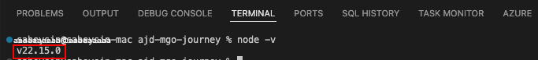
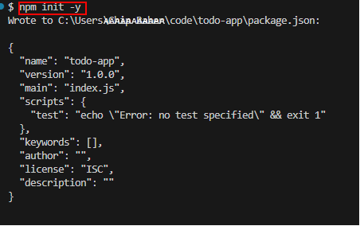
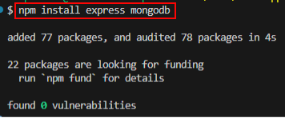
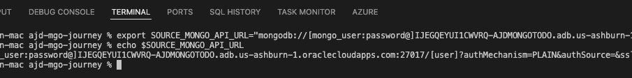
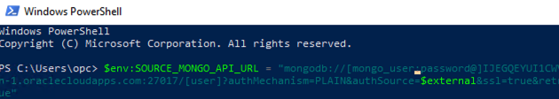
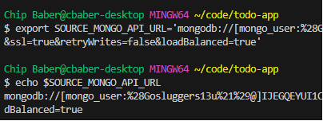
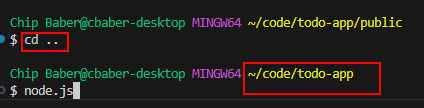
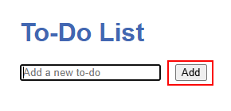
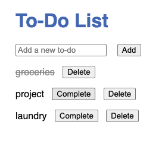

# Lab 3: Build the To-Do App

## Introduction

In this lab, you'll set up the Node.js/Express backend for the To-Do app, connecting it to your AJD instance using the MongoDB driver, and create a simple HTML/JavaScript frontend to interact with it. This demonstrates how existing MongoDB code works directly with AJD and completes the full-stack app.

> **Estimated Time:** 35 minutes

**Note:** Cline can review your code for improvements, such as adding error handling or optimizing queries—just provide the code!

---

### Objectives

In this lab, you will:
- Create project directory and install dependencies
- Configure the connection to AJD and implement CRUD operations
- Create the frontend UI
- Run and test the full application

---

### Prerequisites

This lab assumes you have:
- Completed Lab 2
- Node.js and NPM installed
- Your AJD connection string

Before you start, confirm Node and npm are available:

```bash
<copy>
node -v
npm -v
</copy>
```

---

## Task 1: Create Project Directory
1. Open VS Code Terminal and Check Node Version to check it is properly installed.

```bash
<copy>
node -v
</copy>
```



2. Create a new directory for your app:

```bash
<copy>
mkdir todo-app
cd todo-app
</copy>
```

3. Initialize NPM:

```bash
<copy>
npm init -y
</copy>
```

> **Cline prompt:**
> “I’m building a Node.js + Express + MongoDB CRUD To-Do app that will connect to Oracle AJD via the MongoDB API. Create a step-by-step plan and confirm what files I should create.”

## Task 2: Install Dependencies

Install Express and MongoDB driver:

```bash
<copy>
npm install express mongodb
</copy>
```


*Note* To install node on your system, the instructions can be found on the [NodeJS Website](https://nodejs.org/en/download)

## Task 3: Create server.js

Create a file named `server.js` with the following content:

> **Cline prompt:**
> “Generate an Express server with CRUD endpoints for a `todos_source` collection using the Node MongoDB driver. Read `SOURCE_MONGO_API_URL` and `COLLECTION_NAME` from environment variables.”

```javascript
<copy>
// server.js
//require('dotenv').config(); // only if using .env

const express = require('express');
const { MongoClient, ObjectId } = require('mongodb');

const app = express();
const PORT = process.env.PORT || 3000;
const COLLECTION_NAME = process.env.COLLECTION_NAME || 'todos_source';

app.use(express.json());
app.use(express.static('public'));

let db;

async function connectDB() {
  const client = new MongoClient(process.env.SOURCE_MONGO_API_URL);
  await client.connect();
  db = client.db(); // use default DB from connection string
  // Optional: Ping to test connection
  await db.command({ ping: 1 });
  console.log('Connected to Oracle AJD (Mongo API)');
}

app.get('/api/status', async (req, res) => {
  try {
    await db.command({ ping: 1 });
    res.json({ status: 'ok' });
  } catch (err) {
    res.status(500).json({ status: 'error', error: err.message });
  }
});

// Read todos
app.get('/api/todos', async (req, res) => {
    const todos = await db.collection(COLLECTION_NAME).find().toArray();
    res.json(todos);
  });
  
// Create todo
app.post('/api/todos', async (req, res) => {
    const todo = { text: req.body.text, completed: false };
    const result = await db.collection(COLLECTION_NAME).insertOne(todo);
    res.json({ _id: result.insertedId, ...todo });
});
  
// Update todo (mark as completed)
app.put('/api/todos/:id', async (req, res) => {
const result = await db.collection(COLLECTION_NAME).updateOne(
    { _id: new ObjectId(req.params.id) },
    { $set: { completed: true } }
);
res.json({ modifiedCount: result.modifiedCount });
});
  
// Delete todo
app.delete('/api/todos/:id', async (req, res) => {
    const result = await db.collection(COLLECTION_NAME).deleteOne({ _id: new ObjectId(req.params.id) });
    res.json({ deletedCount: result.deletedCount });
});

app.listen(PORT, async () => {
  await connectDB();
  console.log(`Server listening on port ${PORT}`);
});
</copy>
```

**Note:** This code is from the sample app. Cline can help customize it, e.g., adding authentication. The 'todos' collection will auto-create in AJD on the first insert operation; no explicit creation step is needed.

## Task 4: Configure Environment

Set the env variable **SOURCE\_MONGO\_API\_URL**:
GitBash/Linux/MacOS
```bash
<copy>
export SOURCE_MONGO_API_URL='your-connection-string'
</copy>
```


Windows (PowerShell):

```powershell
$env:SOURCE_MONGO_API_URL = "your-connection-string"
```


Windows GitBash
```bash
<copy>
export SOURCE_MONGO_API_URL='your-connection-string'
</copy>
```


**Note** Make sure to only use single quotes ' ' around the connection string.

## Task 5: Create Frontend UI

1. In your project directory, create a `public` folder:

```bash
<copy>
mkdir public
</copy>
```

2. **Note:** Here is an example of Cline generated output that is consistent with the lab. If using cline generated output instead of prompts, inside `public`, create `index.html` with the following content:

```html
<copy>
<!DOCTYPE html>
<html lang="en">
<head>
  <meta charset="UTF-8">
  <title>AJD-Powered Mongo To-Do List</title>
  <style>
    body { font-family: sans-serif; max-width: 600px; margin: 2em auto; }
    h1 { color: #4267b2; }
    ul { padding-left: 0; }
    li { list-style: none; margin: 1em 0; display: flex; align-items: center; }
    .completed { text-decoration: line-through; color: #888; }
    button { margin-left: 1em; }
  </style>
</head>
<body>
  <h1>To-Do List</h1>
  <input id="todo-input" type="text" placeholder="Add a new to-do" />
  <button onclick="addTodo()">Add</button>
  <ul id="todo-list"></ul>

  <script>
    async function fetchTodos() {
      const res = await fetch('/api/todos');
      const todos = await res.json();
      const list = document.getElementById('todo-list');
      list.innerHTML = '';
      todos.forEach(todo => {
        const li = document.createElement('li');
        li.className = todo.completed ? 'completed' : '';
        li.textContent = todo.text;

        if (!todo.completed) {
          const completeBtn = document.createElement('button');
          completeBtn.textContent = 'Complete';
          completeBtn.onclick = () => completeTodo(todo._id);
          li.appendChild(completeBtn);
        }

        const deleteBtn = document.createElement('button');
        deleteBtn.textContent = 'Delete';
        deleteBtn.onclick = () => deleteTodo(todo._id);
        li.appendChild(deleteBtn);

        list.appendChild(li);
      });
    }

    async function addTodo() {
      const input = document.getElementById('todo-input');
      const text = input.value.trim();
      if (!text) return;
      await fetch('/api/todos', {
        method: 'POST',
        headers: { 'Content-Type': 'application/json' },
        body: JSON.stringify({ text })
      });
      input.value = '';
      fetchTodos();
    }

    async function completeTodo(id) {
      await fetch('/api/todos/' + id, { method: 'PUT' });
      fetchTodos();
    }

    async function deleteTodo(id) {
      await fetch('/api/todos/' + id, { method: 'DELETE' });
      fetchTodos();
    }

    // Fetch todos when page loads
    window.onload = fetchTodos;
  </script>
</body>
</html>
</copy>
```

**Note:** This JS handles API calls. Cline can help add features like sorting or filtering.

## Task 6: Run and Test the Application

1. Go to the application directory by entering cd.. to the NodeJS directory and Start the server:

``` cd ..  ``



```bash
<copy>
node server.js
</copy>
```

2. Open `http://localhost:3000` in your browser add new to-do items and click Add Button.





3. Add, complete, and delete todos to verify CRUD operations with AJD.

4. (Optional) Verify backend connectivity:

```bash
<copy>
curl http://localhost:3000/api/status
</copy>
```

Expected: `{ "status": "ok" }`

**Congratulations!** You've deployed a full-stack MongoDB-compatible app on AJD.

You are now ready for Lab 4 to prepare source data and analyze for migration.

## Troubleshooting

- **Node Version Issues:** Ensure you are using Node.js v24 or later in both the todo-app and migration-cli directories. If you encounter a SyntaxError on '??=', switch with `nvm use 24` and confirm with `node -v`. The mongodb package requires Node >=20.19.0.

- **Installation Errors:** If npm install fails with network errors (e.g., ENOTFOUND), ensure you're not on a VPN or behind a proxy interfering with the registry. For public users, it pulls from npmjs.org.

- **Server Startup Errors:** If you see syntax errors, confirm Node.js version (>=18). For connection issues, refer to Lab 2's troubleshooting.

- **UI Not Loading:** Ensure the server is running and the public directory is correctly placed.

- **Testing CRUD:** Besides the UI, you can test APIs with curl, e.g.:
  - GET todos: `curl http://localhost:3000/api/todos`
  - POST todo: `curl -X POST http://localhost:3000/api/todos -H "Content-Type: application/json" -d '{"text": "Test"}'`
  - PUT complete: `curl -X PUT http://localhost:3000/api/todos/<id>`
  - DELETE: `curl -X DELETE http://localhost:3000/api/todos/<id>`

This helps verify backend before UI.

---

## Acknowledgements

**Authors**
* **Luke Farley**, Senior Cloud Engineer, ONA Data Platform S&E

**Last Updated By/Date:**
* **Luke Farley**, Senior Cloud Engineer, ONA Data Platform S&E, November 2025
