# Lab 1: Configure Cline AI Assistant

## Introduction

This lab walks you through installing and configuring **Cline**, an AI-powered software engineering assistant in Visual Studio Code (VS Code) for coding tasks, debugging, and more.

> **Estimated Time:** 15-30 minutes

---

### About Cline

Cline is a highly skilled AI software engineer with extensive knowledge in programming languages, frameworks, design patterns, and best practices. It can assist with tasks like writing code, editing files, executing commands, and integrating with various tools, all within VS Code.

---

### Objectives

In this lab, you will:
- Install the required VS Code extension for Cline
- Install the VS Code Extension for GitHub Copilot
- Configure Cline with GitHub Copilot 
- Test the installation and basic functionality

---

### Requirements

This lab will show you how to following requirements for this workshop:
* Visual Studio Code installed on your machine (download: https://code.visualstudio.com/download)
* Create/Login Github 
* Install Visual Studio Cline Extensions - Cline and Github Copilot
* Configure Cline Github Copilot Free Credits Connection
* Install Visual Studio SQL Developer Extension
* [Windows Only] Install Git/GitBash 
* Install NodeJS
* Test the Installation

---
## Task 1: Install Visual Studio Code installed on your machine 

1. You can download Visual Studio Code from this link (download: https://code.visualstudio.com/download) 

Note:  if you need further assistance regarding your VS Code setup based on your operating system you can follow instructions below, if not you can skip this step.

### Install VS Code on macOS

* Download Visual Studio Code for macOS. 

* Open the downloaded .dmg file

* Drag Visual Studio Code.app to the Applications folder

* Open VS Code from the Applications folder, by double clicking the icon.

* Add VS Code to your Dock by right-clicking on the icon, located in the Dock, to bring up the context menu and choosing Options, Keep in Dock.

Visual Studio Code on macOS - (https://code.visualstudio.com/docs/setup/mac)

### Install VS Code on Windows

* Use the Windows installer and run the installer (VSCodeUserSetup-{version}.exe) or use the Zip File run VS Code from there

Visual Studio Code on Windows - (https://code.visualstudio.com/docs/setup/windows)


### Install VS Code on Linux

* Download and install Visual Studio Code for your Linux distribution (https://code.visualstudio.com/docs/setup/linux)


## Task 2: Create/Login Github 

1. To sign up for an account, navigate to https://github.com/ and follow the prompts.

Note: For Getting started with your GitHub account you follow instructions here. (https://docs.github.com/en/get-started/onboarding/getting-started-with-your-github-account)

## Task 3: Install VS Code Extension: Cline

1. Open Visual Studio Code.

2. Go to the Extensions view by clicking the Extensions icon in the Activity Bar on the side or pressing `Ctrl+Shift+X` (Windows/Linux) or `Cmd+Shift+X` (macOS).

3. Search for 'Cline' in the searchbox.

4. Click Install on the chosen extension.

  <!-- Placeholder; replace with actual image if available -->

## Task 4: Install VS Code Extension: Github Copilot

1. Navigate to your operating system 

2. Open Visual Studio Code.

2. Go to the Extensions view by clicking the Extensions icon in the Activity Bar on the side or pressing `Ctrl+Shift+X` (Windows/Linux) or `Cmd+Shift+X` (macOS).

3. Search for 'GitHub Copilot' in the searchbox.

4. Click Install on the chosen extension.

  <!-- Placeholder; replace with actual image if available -->


## Task 4: Configure Cline Github Copilot Free Credits Connection

1. Open the Cline view:
   - Click the **Cline** icon in the VS Code Activity Bar (left side), or
   - Open the command palette (`Ctrl+Shift+P` on Windows/Linux or `Cmd+Shift+P` on macOS) and search for **Cline: Focus on View**.

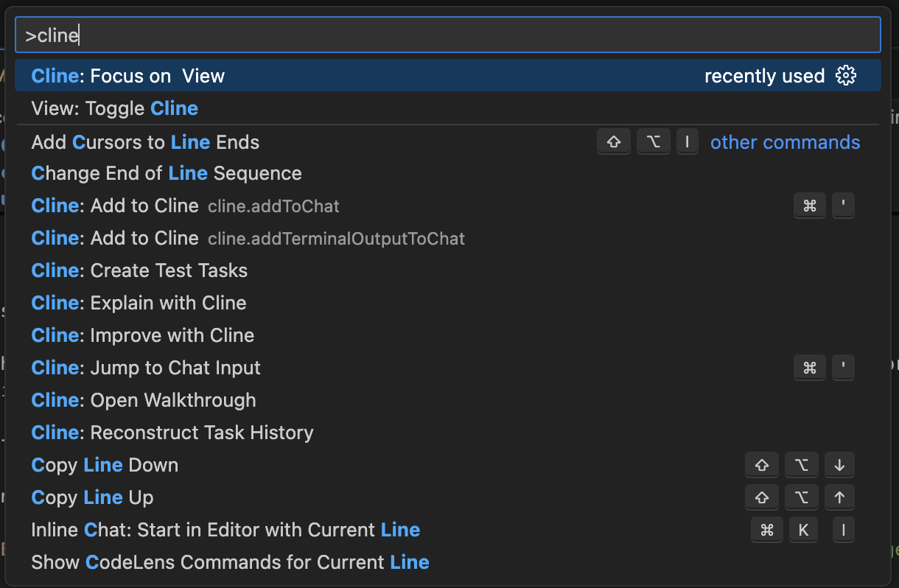

2. Select **Bring your own API Key**.

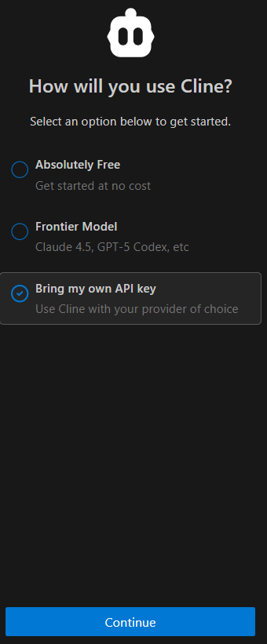

3. Click **Continue**, then paste your provider API key and select a model.

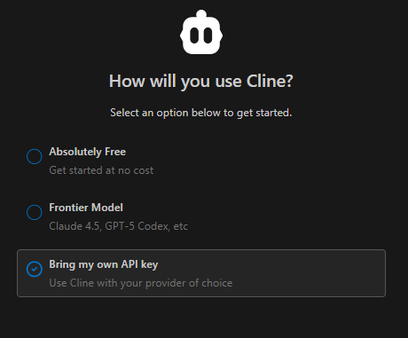

**Note** If cline is not appearing, try restarting the VS Code environment after install.

3. Save the settings and restart VS Code if prompted.

## Task 4: Configure Cline for GitHub Copilot

1. Go to the Extensions icon of Cline, and select Settings icon.

2. Select Api Provider as GiHub Copilot


3. Select  copilot - copilot-fast model from Language Model drop down list.

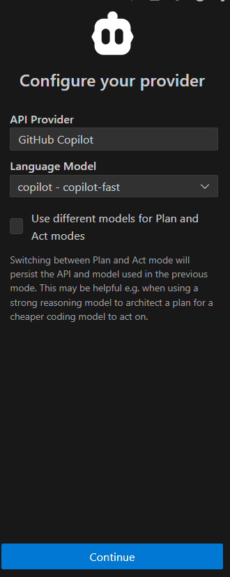

## Task 5: Install Visual Studio SQL Developer Extension


1. Go to the Extensions view by clicking the Extensions icon in the Activity Bar on the side or pressing `Ctrl+Shift+X` (Windows/Linux) or `Cmd+Shift+X` (macOS).

2. Search for 'SQL Developer' in the searchbox.

3. Click Install on the chosen extension.

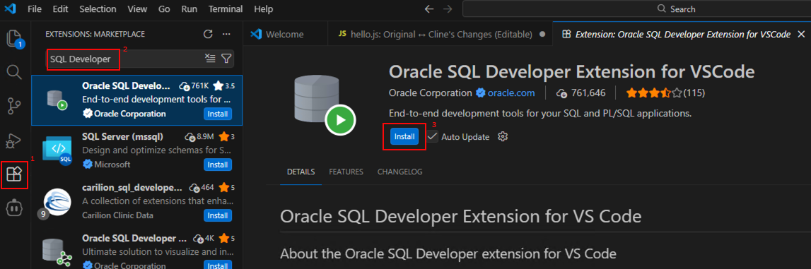

## Task 6: [Windows Only] Install Git/GitBash 

1. Click Git icon and click download Git for Windows

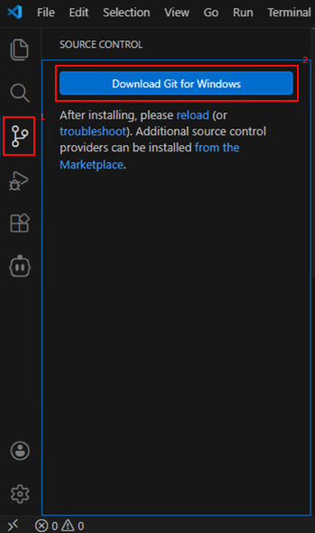

2. Once you clicked download Git for Windows button, you can see a pop-up window to open the external website where you have redirected to Git Download and Install page.

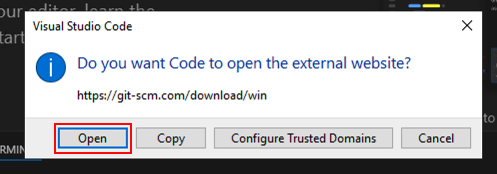

### Task 6:  NodeJS Installation

1. Go to the Extensions view by clicking the Extensions icon in the Activity Bar on the side.

2. Search for 'NodeJS' in the searchbox.

3. Click Install on the chosen extension.

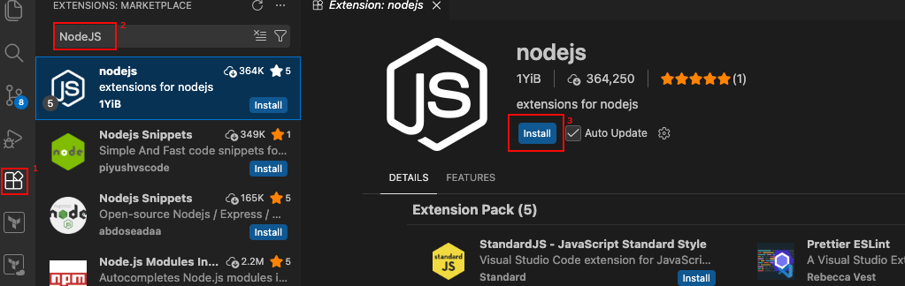


## Task 7: Test the Installation

1. Open a code file in VS Code.

2. Activate Cline by using the extension's shortcut (or ctrl+shift+p, Cline: Focus on view).

3. Create a small test file (for example `hello.js`) and paste this code:

   ```js
      function add(a, b) {
      return a + b;
      }
      module.exports = { add };
   ```
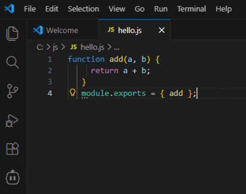

4. In VS Code, highlight the code and either:
   - Right-click and choose **Add to Cline**, or
   - Copy/paste it into the Cline chat panel.

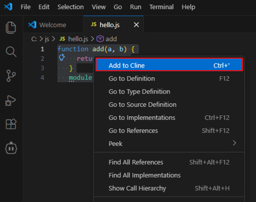

5. Ask Cline:
   - "Explain what this code does and suggest one improvement."

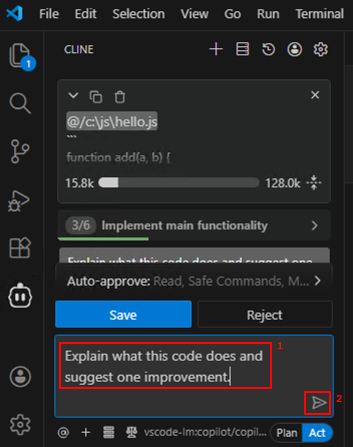

6. Verify that Cline responds correctly using your configured LLM.

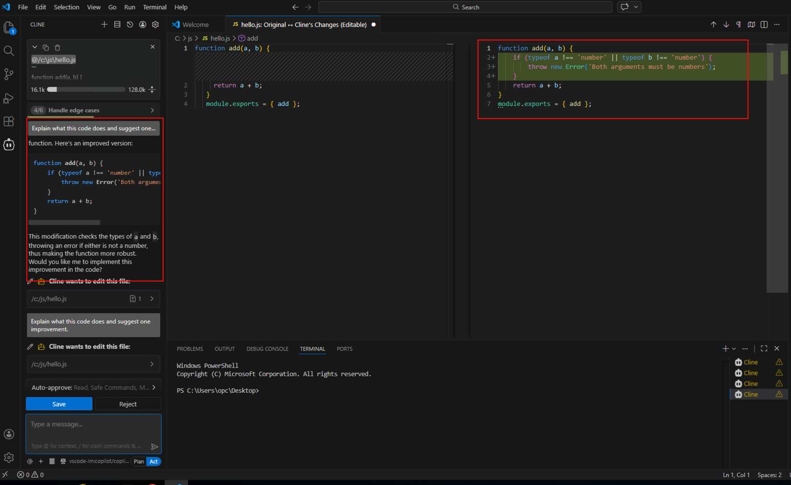

---

## Next Steps

With Cline installed, you can now use it for advanced coding tasks in your projects. Explore features like tool usage (e.g., reading/writing files, executing commands) and integrate it into your workflow. Refer to the extension's documentation for more advanced configurations.

---

## Acknowledgements

**Authors**  
* **Luke Farley**, Senior Cloud Engineer, NA Data Platform S&E

**Contributors**
* **Cline AI** 

**Last Updated By/Date:**  
* **Luke Farley**, Senior Cloud Engineer, NA Data Platform S&E, November 2025
