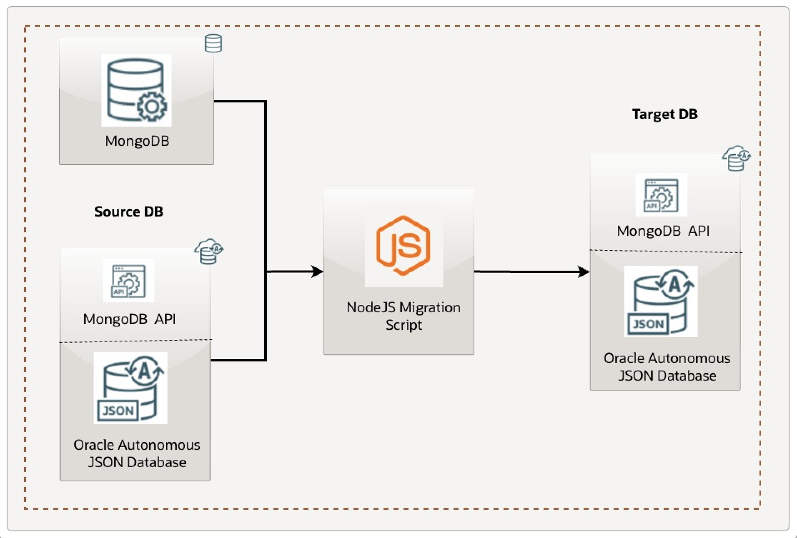

# Introduction

## About this Workshop

Welcome to **Mongo Developer Journey — Build, Migrate & Scale on Oracle AI Database**!  
This comprehensive hands-on workshop combines building a MongoDB-compatible application with migrating it to Oracle Autonomous JSON Database (AJD) for enhanced performance, scalability, and AI capabilities. You'll deploy a simple CRUD To-Do list application using Node.js and Express, connect it to AJD via its MongoDB API, prepare and analyze data, build a CLI tool to migrate within AJD (simulating a full migration), and validate while exploring AJD 26ai features.

This end-to-end experience demonstrates AJD as a drop-in replacement for MongoDB, with minimal changes for build and migration.

You'll learn how to:
- Setup your local environment for Vibe Coding
- Provision AJD and build a full-stack app
- Prepare source data and plan migration
- Build and run a migration CLI
- Validate and cale on AI JSON Database

> **Estimated Workshop Time:** 2 hours

### Objectives

By completing this workshop, you will:
- Build a MongoDB-compatible app on AJD
- Prepare, analyze, and migrate data within AJD
- Validate functionality and explore AJD benefits like auto-scaling and AI integration
- Gain an end-to-end developer journey from build to migration on Oracle AI JSON Database

**Architecture Overview:**  
The app uses Node.js/Express for the backend, connecting to AJD via the MongoDB driver. You'll then migrate data using a custom CLI and repoint the app.

---

### Prerequisites

This workshop assumes you have:
- An Oracle Cloud account
- Basic knowledge of Node.js and MongoDB
- Node.js (v18+) and NPM installed
- Familiarity with command-line tools

## Labs Overview

- **Lab 1: Configure Cline AI Assistant** - Set up AI assistance (required for this workshop).
- **Lab 2: Provision and Connect to AJD** - Setup AJD instance.
- **Lab 3: Build the To-Do App** - Create backend and frontend.
- **Lab 4: Prepare Source Data and Analyze** - Insert data and plan migration.
- **Lab 5: Build Migration CLI and Migrate** - Create CLI and perform migration.
- **Lab 6: Validate and Explore AJD Benefits** - Test app and explore features.

---

## Learn More

* [Oracle Autonomous JSON Database Documentation](https://docs.oracle.com/en/cloud/paas/autonomous-json-database/index.html)
* [MongoDB API in AJD](https://docs.oracle.com/en/database/oracle/mongodb-api/mgapi/overview-oracle-database-api-mongodb.html#GUID-D1F0C555-73AE-4263-B59C-448925B963A8)
* [Node.js MongoDB Driver](https://www.mongodb.com/docs/drivers/node/current/)

---

## Acknowledgements

**Authors**
* **Luke Farley**, Senior Cloud Engineer, ONA Data Platform S&E

**Contributors**
* **Cline**, AI Assistant
* **Kaushik Kundu**, Master Principal Cloud Architect, ONA Data Platform S&E
* **Enjing Li**, Senior Cloud Engineer, ONA Data Platform S&E

**Last Updated By/Date:**
* **Luke Farley**, Senior Cloud Engineer, ONA Data Platform S&E, November 2025
