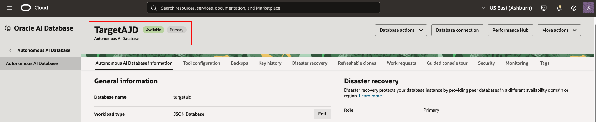
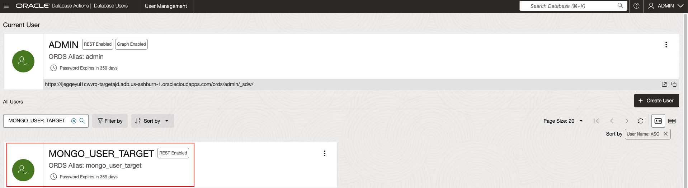
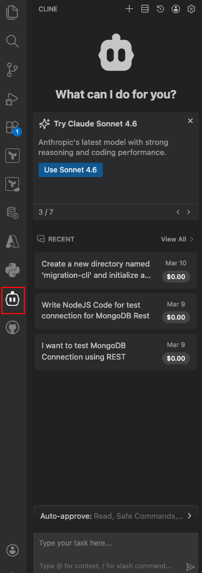
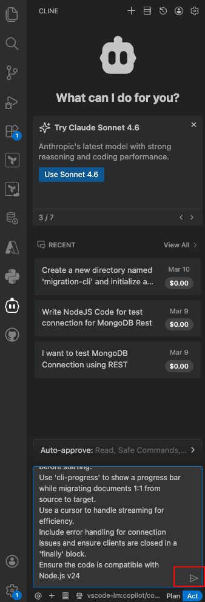
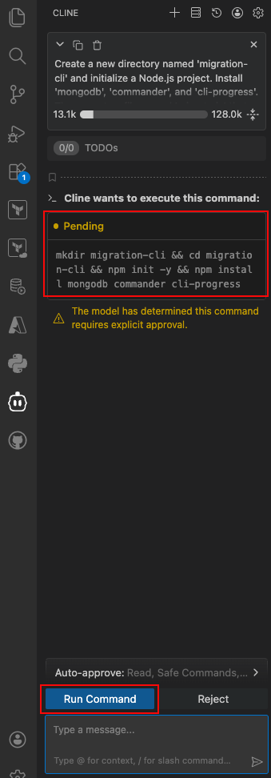
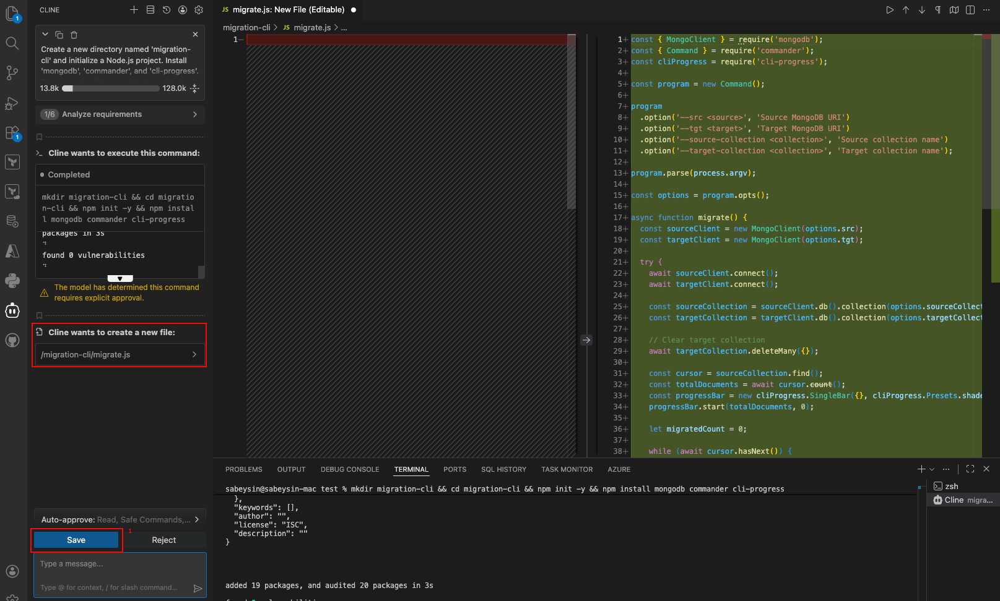
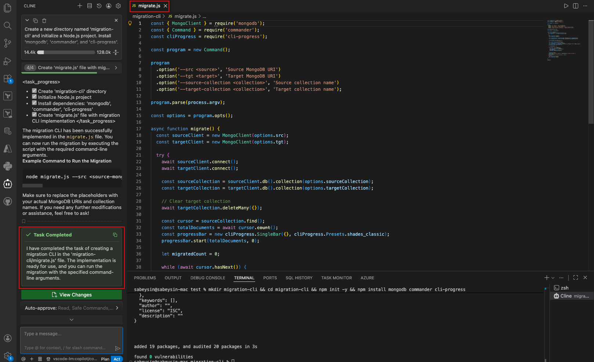
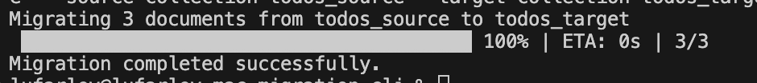

# Lab 5: Build Migration CLI and Migrate

## Introduction

In this lab, you'll build a simple CLI tool to migrate data from your **source AJD** to a **target AJD** (or a separate target user) to simulate a real migration. You'll run the migration and handle any basic transformations.

> **Estimated Time:** 30 minutes

**Note:** If using Cline, it can help refine the CLI code or debug migration issues.

---

### Objectives

In this lab, you will:
- Use a source AJD and a separate target AJD to simulate a real migration
- Build a CLI tool to transfer collections and data
- Run the migration and monitor progress
- Handle any data transformation or mapping needs

---

### Prerequisites

This lab assumes you have:
- Completed Lab 4
- Your source AJD URI from Lab 2
- A target AJD URI (created in Task 1)
- The To-Do app data in 'todos_source' collection

---

## Task 1: Provision Target AJD Instance

1. Follow Tasks 1-3 in Lab 2: Provision and Connect to AJD to provision a new AJD instance for the target (e.g., name it "TargetAJD"). Create a separate user (recommended: **MONGO_USER_TARGET**) and enable the MongoDB API.

   **Note:** This keeps source and target separate to demonstrate the migration architecture clearly. Use your existing MongoDB or the Source-AJD from Lab 2 as the source.
TargetAJD Autonomouse AI Database after following instruction in Lab 2 Task 1.
   
MONGO_USER_TARGET user after following instruction in Lab 2 Task 2.
   


2. Ensure you have the source connection string ready (from Lab 2 as `$SOURCE_MONGO_API_URL`) and provision a new one for the target as `$TARGET_MONGO_API_URL`. Follow Lab 2 Task 4 instruction to copy source and target MongoDB API URLs.

   

3. Export both environment variables and verify they are set:

   ```bash
   <copy>
   export SOURCE_MONGO_API_URL='...'
   export TARGET_MONGO_API_URL='...'

   echo $SOURCE_MONGO_API_URL
   echo $TARGET_MONGO_API_URL
   </copy>
   ```

**Note:** You can terminate both AJD instances after completing the LiveLab to avoid ongoing costs.

---

## Task 2: Build the Migration CLI
1. From VS Code, open Cline Extension again.

 

2. Copy below text for the Cline Prompt.

```bash
<copy>
Create a new directory named 'migration-cli' and initialize a Node.js project. Install 'mongodb', 'commander', and 'cli-progress'. Then, create a file named 'migrate.js' that implements a migration CLI.
The CLI must:
Use 'commander' to accept --src, --tgt, --source-collection, and --target-collection arguments.
Connect to both MongoDB URIs.
To ensure it is safe to re-run, clear the target collection using 'deleteMany({})' before starting.
Use 'cli-progress' to show a progress bar while migrating documents 1:1 from source to target.
Use a cursor to handle streaming for efficiency.
Include error handling for connection issues and ensure clients are closed in a 'finally' block.
Ensure the code is compatible with Node.js v24
</copy>
```

3. Paste it in Cline Prompt and Click Execute Button highlighted below.



4. You can see Pending Item and Cline wants to execute this command. Click Run Command to execute it.



5. After succefully ran above command, Cline wants to create a new file. Click Save Button to create migrate.js file.



6. You can confirm your Task has been completed and migrate.js has been created.



<!-- 1. In a new directory (e.g., `migration-cli`), initialize the project:
   ```bash
   <copy>
   mkdir migration-cli
   cd migration-cli
   npm init -y
   </copy>
   ```

2. Install dependencies:
   ```bash
   <copy>
   npm install mongodb commander cli-progress
   </copy>
   ```

> **Cline prompt (optional):**
> “Generate a Node.js CLI that migrates documents from a source MongoDB URI to a target MongoDB URI. Use commander for args and include a progress bar. Make it safe to re-run.”

3. Create `migrate.js` with the following code:
   ```javascript
   <copy>
   const { MongoClient } = require('mongodb');
   const { Command } = require('commander');
   const cliProgress = require('cli-progress');

   const program = new Command();

   program
     .requiredOption('--src <uri>', 'Source MongoDB URI')
     .requiredOption('--tgt <uri>', 'Target AJD URI')
     .requiredOption('--source-collection <name>', 'Source collection name')
     .requiredOption('--target-collection <name>', 'Target collection name');

   program.parse(process.argv);

   const options = program.opts();

   async function migrateCollection() {
     const srcClient = new MongoClient(options.src);
     const tgtClient = new MongoClient(options.tgt);

     try {
       await srcClient.connect();
       await tgtClient.connect();

       const srcCol = srcClient.db().collection(options.sourceCollection);
       const tgtCol = tgtClient.db().collection(options.targetCollection);

       // Clear target collection before migration to avoid unique constraint violations
       await tgtCol.deleteMany({});

       const count = await srcCol.countDocuments();
       console.log(`Migrating ${count} documents from ${options.sourceCollection} to ${options.targetCollection}`);

       const bar = new cliProgress.SingleBar({}, cliProgress.Presets.shades_classic);
       bar.start(count, 0);

       const cursor = srcCol.find();
       let migrated = 0;

       while (await cursor.hasNext()) {
         const doc = await cursor.next();
         // Optional: Basic transformation (e.g., add a field)
         // doc.migrated = true;
         await tgtCol.insertOne(doc);
         migrated++;
         bar.update(migrated);
       }

       bar.stop();
       console.log('Migration completed successfully.');
     } catch (error) {
       console.error('Migration error:', error);
     } finally {
       await srcClient.close();
       await tgtClient.close();
     }
   }

   migrateCollection();
   </copy>
   ```

   This script supports separate source and target URIs.

---
-->
## Task 3: Run the Migration

When running the migration CLI, users reusing the AJD instance from 
*Create a MongoDB-Compatible App with Autonomous JSON Database* or *MongoDB Migration – Lift & Shift to Oracle AI Database* Livelabs should ensure the source collection name matches the collection they intend to migrate. If not, the CLI may show a “successful migration” but migrate zero documents. The target collection can be any name since AJD will create it automatically.

1. Execute the CLI with separate source and target URIs:
   ```bash
   <copy>
   node migrate.js --src "$SOURCE_MONGO_API_URL" --tgt "$TARGET_MONGO_API_URL" --source-collection todos_source --target-collection todos_target
   </copy>
   ```

   **Note:** If using the same instance for simplicity, set both --src and --tgt to the same URI, but prefer separate instances for a clear demonstration.

2. Monitor the progress bar and output.



---
<!--
## Task 4: Handle Transformations (Optional)

If needed, modify the script in Task 1 (e.g., in the while loop, adjust `doc` before inserting). For this workshop, assume a simple 1:1 migration. Cline can assist with custom transformations.

---

## Troubleshooting

- **Node Version Issues:** Ensure you are using Node.js v24 or later in both the todo-app and migration-cli directories. If you encounter a SyntaxError on '??=', switch with `nvm use 24` and confirm with `node -v`. The mongodb package requires Node >=20.19.0.

- **URI Encoding:** Ensure special characters are encoded.
- **Unique Constraint Violations (ORA-00001):** If you encounter errors about unique constraints (e.g., duplicate _id), clear the target collection before migration by adding `await tgtCol.deleteMany({});` before the count and migration loop in migrate.js.
- **Large Datasets:** The cursor handles streaming for efficiency.
- **Errors:** Check connections; add logging if needed for debugging.
-->
You are now ready for Lab 6 to validate and explore.

---

## Acknowledgements

**Authors**
* **Luke Farley**, Senior Cloud Engineer, ONA Data Platform S&E

**Contributors**
* **Kaushik Kundu**, Master Principal Cloud Architect, ONA Data Platform S&E
* **Enjing Li**, Senior Cloud Engineer, ONA Data Platform S&E
* **Cline**, AI Assistant

**Last Updated By/Date:**
* **Luke Farley**, Senior Cloud Engineer, ONA Data Platform S&E, November 2025
