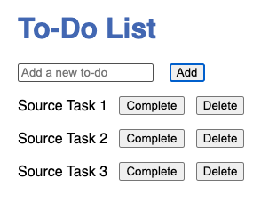
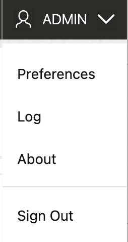
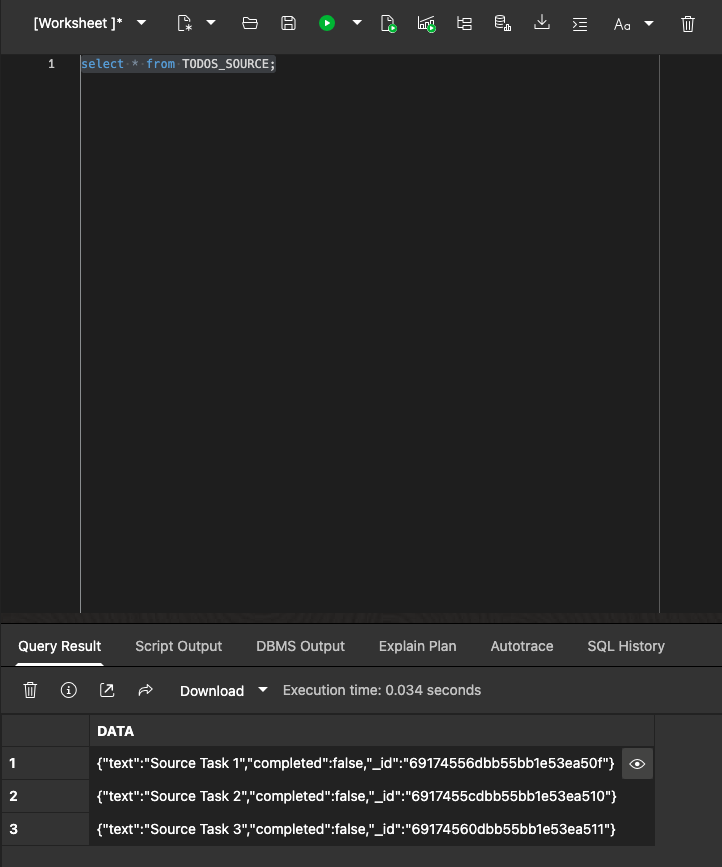

# Lab 4: Prepare Source Data and Analyze

## Introduction

In this lab, you'll insert sample data into your To-Do app running on AJD, review the schema and collections in Oracle SQL Web, and analyze the data to plan the migration to a target collection in the same AJD instance. This step ensures you understand your data before migrating.

> **Estimated Time:** 20 minutes

**Note:** If you're using Cline (from Lab 1), it can help generate analysis queries or suggest migration mappings.

---

### Objectives

In this lab, you will:
- Insert sample data via the app UI
- Review the application schema and collections in Oracle SQL Web
- Analyze your source environment and plan the migration

---

### Prerequisites

This lab assumes you have:
- Completed Lab 3 with the To-Do app running
- Access to Oracle Database Actions (SQL Web) for your AJD instance

---

## Task 1: Insert Sample Data

1. Ensure your To-Do app server is running (`node server.js` from Lab 3).

2. Open `http://localhost:3000` in your browser.

3. Use the UI to add a few to-do items (e.g., "Source Task 1", "Source Task 2"). Complete or delete one to test functionality.

> **Cline prompt (optional):**
> “Suggest a small set of test to-do items that cover create/complete/delete and help validate a migration.”



---

## Task 2: Review Schema and Collections

1. In Oracle Database Actions (SQL Web from AJD console):
   - In the OCI Console, open your AJD database.
   - Click **Database actions** and launch **SQL** (SQL Web).
   
   - By default you may be logged in as admin, go ahead and sign out.
   
   - Log in to AJD as database user, e.g. **MONGO_USER**.
   
   
   - Run:

     ```sql
     <copy>
     SELECT * FROM todos_source;
     </copy>
     ```

   - Note the schema (e.g., DATA column with JSON: _id, text, completed).

   

   **Why does `todos_source` show up in SQL?**
   When you use the MongoDB API against AJD, documents are stored as JSON and can be exposed through relational views/tables in Database Actions. This lets you query JSON using SQL while still using MongoDB drivers in your application.

2. Explore other tables if needed.

---

## Task 3: Analyze and Plan Migration

1. Confirm you have source data and understand its shape:
   - Count documents
   - Identify key fields (`_id`, `text`, `completed`)

2. Plan: For this simple app, map 1:1 to a new 'todos_target' collection. No transformations are required.

With your source data prepared and analyzed, you're ready for Lab 5 to build the migration CLI and perform the migration.

## Troubleshooting

- **Data Not Appearing:** Ensure the app is connected to AJD and inserts are successful (check server logs).
- **SQL Web Access:** Verify ADMIN credentials and network access.

---

## Acknowledgements

**Authors**
* **Luke Farley**, Senior Cloud Engineer, ONA Data Platform S&E

**Contributors**
* **Cline**, AI Assistant

**Last Updated By/Date:**
* **Luke Farley**, Senior Cloud Engineer, ONA Data Platform S&E, November 2025
