# Lab 2: Provision and Connect to AJD

## Introduction

In this lab, you'll provision an Oracle Autonomous JSON Database (AJD) instance and enable its MongoDB-compatible API. This allows your MongoDB applications to connect seamlessly, treating AJD as a drop-in replacement.

> **Estimated Time:** 15 minutes

---

### Objectives

In this lab, you will:
- Create an AJD instance in Oracle Cloud
- Enable the MongoDB API
- Obtain the connection string for your app

---

### Prerequisites

This lab assumes you have:
- Completed Lab 1 
- An active Oracle Cloud account with permissions to create AI databases

---

## Task 1: Provision AJD Instance

1. Navigate to [Oracle Cloud Sign In](https://www.oracle.com/cloud/sign-in.html?redirect_uri=https%3A%2F%2Fcloud.oracle.com%2F) and log in.


2. Inside the Oracle Cloud Console and Click Navigation Menu.

   

2. Navigate to **Oracle Database > Autonomous AI Database**.

   

3. Click **Create Autonomous Database**.

   

4. Rename Display name as **ajd-mongo-todo** 
   ```
   ajd-mongo-todo
   ```
   Rename Database name as **ajdmongotodo**
   ```
   ajdmongotodo
   ```
   Select **JSON Database** as the workload type.

   

   Set the Database version to **26ai**.

   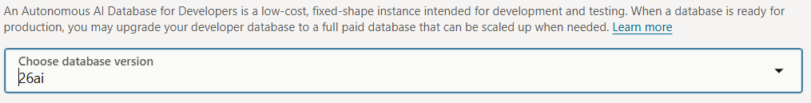

5. Set admin password and configure network access. Set access type to 'Secure access from allowed IPs and VCNs only' (add your IP to the ACL for security).

   

   Switch on “Add my IP address” -> That’ll directly include your IP Address in the ACL.

   

   If you’re not sure from where you will want to connect from, you can change the IP notation type field to CIDR block, and enter a value of 0.0.0.0/0. That will allow you to connect from anywhere, but naturally you should only use that for testing.

   **Note** Alternatively, to get your public ip address, you can go to whatismyipaddress.com, or run the following command

   ```bash
   curl -s ifconfig.me
   ```

6. Click **Create**. Wait for the instance to provision. You should see the following once the provisioning has completed.

   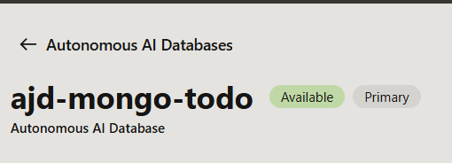

## Task 2: Create Mongo User 

1. Navigate to **Database Users** in from your new Autonomous AI Database.  

   

2. Select Create User. 

   

3. Create new user e.g. **MONGO_USER** with associated password. Set Quota on tablespace to **UNLIMITED** and enable REST, GraphQL, MongoDB API, and Web access.

   

## Task 3: Test mongo_user and SQL Connection.

1. Go Back to ajd-mongo-todo database information page and click **Database Connections**
   

2. Click **Download wallet** Button
   

3. Please create a password for this wallet. Some database clients will require that you provide both the wallet and password to connect to your database (other clients will auto-login using the wallet without a password).

   

4. Go Back to VS Code and open the **SQL Developer Extension**.Then click **Create Connection**.

   

5. Enter Connection Name, Enter Username as ```mongo_user```, password for mongo_user, Click Connection Type as Cloud Wallet, Click Choose File and give downloaded wallet zip file loction, Click Service type as AJSMONDOTODO_MEDIUM, and Click Test Button.

   

5. You can see Test succesfully passed for connection.

   

6. Save Connection by clicking Save Button.

   

6. Also, you can View Connection and Expand to view all objects from SQL Extension.

   

## Task 4: Enable MongoDB API & Formatting the Connect String

1. In the AI JSON Database details page, go to **Tool Configuration**.

   


2. Scroll down, and Under **MongoDB API** confirm your status is set to Enabled.

   

3. Copy the Mongo Connection String from the console. 

   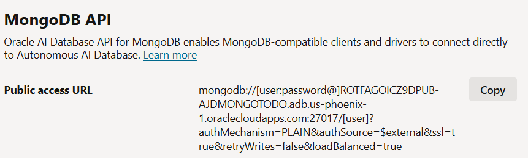

4. Open a new file in VS Code and Paste the connect string into the file.

   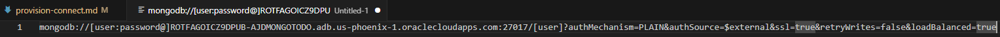

5. Begin to format the string by replacing **[user]** with **mongo_user**.

   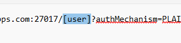

   End result should look like:
   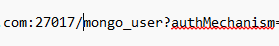

6. Next  replace **[user** with the name **mongo_user**.

   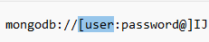

7. Next we need to first check to see if your mongo_user password contains any URI reserved characters. To do this open the following website [w3School](https://www.w3schools.com/tags/ref_urlencode.ASP) and go to the try it yourself section enter your password and press **Submit**. 
   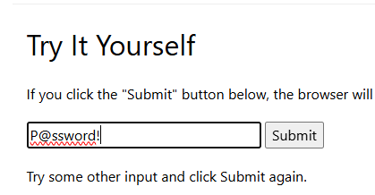

   The page will convert any special characters for you. 
   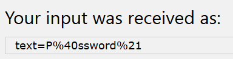

   Copy the text generated to leverage in the next step. In this example you would copy the text.
   ```
   P%40ssword%21
   ```

8. Replace the text **password@]** with your URI encoded password + an @ symbol at the end. 
   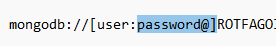

   The end result should look like:
   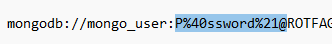

9. This is an example completed url. 
```
mongodb://mongo_user:<your password>@<your ai database url>:27017/mongo_user?authMechanism=PLAIN&authSource=$external&ssl=true&retryWrites=false&loadBalanced=true
```

10. Finally, set this connection string as the `MONGO_API_URL` environment variable so your application can securely access it in the next lab.

**For Mac/Linux:**
```bash
export MONGO_API_URL="mongodb://mongo_user:<your password>@<your ai database url>:27017/mongo_user?authMechanism=PLAIN&authSource=$external&ssl=true&retryWrites=false&loadBalanced=true"
```

**For Windows (Command Prompt):**
```cmd
set MONGO_API_URL="mongodb://mongo_user:<your password>@<your ai database url>:27017/mongo_user?authMechanism=PLAIN&authSource=$external&ssl=true&retryWrites=false&loadBalanced=true"
```

**For Windows (PowerShell):**
```powershell
$env:MONGO_API_URL="mongodb://mongo_user:<your password>@<your ai database url>:27017/mongo_user?authMechanism=PLAIN&authSource=$external&ssl=true&retryWrites=false&loadBalanced=true"
```

You are now ready for Lab 3 to build the To-Do app.

---

## Acknowledgements

**Authors**
* **Luke Farley**, Senior Cloud Engineer, ONA Data Platform S&E

**Contributors**
* **Kaushik Kundu**, Master Principal Cloud Architect, ONA Data Platform S&E
* **Cline AI** 

**Last Updated By/Date:**
* **Luke Farley**, Senior Cloud Engineer, ONA Data Platform S&E, November 2025
